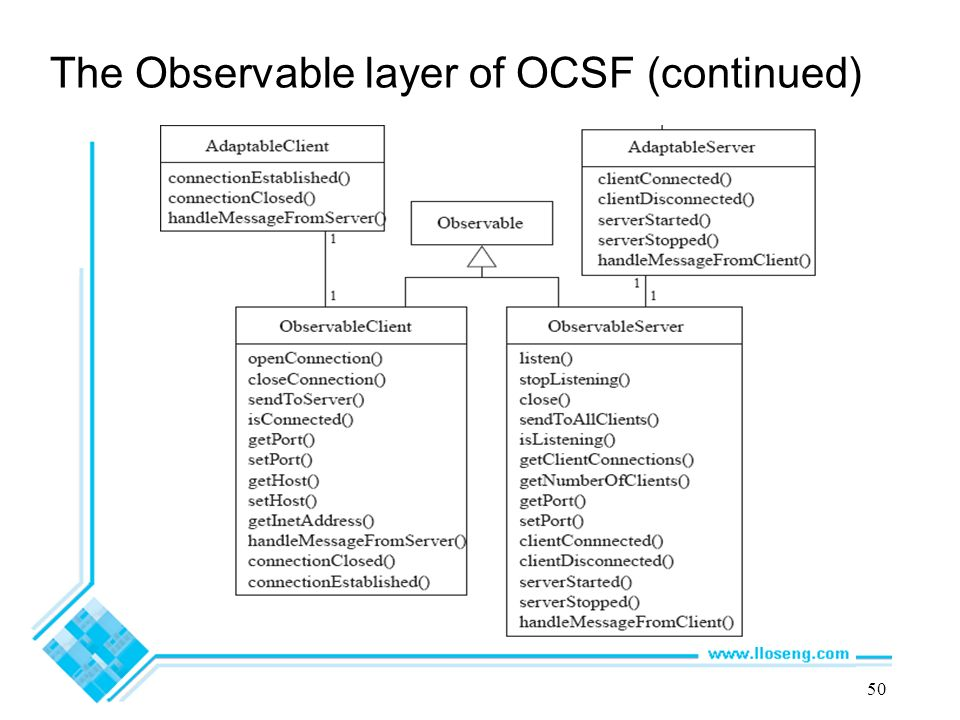
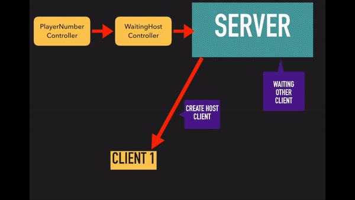
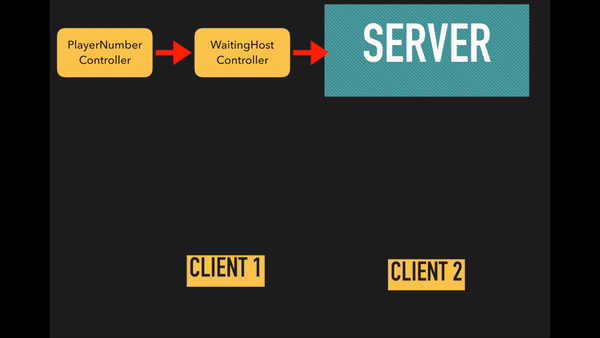

# RabbyHopBanaHamp
by Gunthee Tawewatmongkol ID 6010546915

**Contents**
- [About the program](#about-the-program)
- [Installation](#installation)
- [Demo User](#demo-user)
- [Coding Part](#coding-part)

# About the program
### Description
   An arcade game that players have to jump and dash across a banana peel-flying banana as far as 
possible without dying.(This project has a similarly idea with “T-rex chrome offline game”.)

### Details
   There are 3 modes in this game, single player mode, multiplayer mode, and team mode. The player 
plays as a rabbit and must press up to jump once, press down to dash. The game consists of an endless 
series of obstacles in a set path(banana peels and flying banana).The player must time movements 
correctly in order to pass these obstacles without dying. Every millisecond will earn 1 point.
Before playing, the player can choose theme of the game which are white and black theme(the picture 
in example) and can set the buttons in the setting menu.
	For single player mode, the player just breaks the previous high score.
	For multiplayer mode, the players have to choose number of players(2-4 players). The last player 
survived(get the highest score)is the winner. If there are more than one player that reach the highest 
score, all of them will be the winners.
	For team mode, 2 players have to pass the obstacles to get the points.


# Installation
This program runs on Java 8 with Internet Connection(multiplayer mode).
### Required Library
The Object Client-Server Framework (OCSF) -> https://skeoop.github.io/frameworks/ocsf-231.jar
### How to run
You can download the game and run it on your IDE or by open jar file 
1. Download whole folder >> 
   Click [here](https://github.com/KameriiJ/RabbyHopBananasHamp) to get through the git hup repo.
2. Runs RabbyHopsBananasHamp.jar file. >> Click [here](https://goo.gl/MJkg8s) to get jar file.

# Demo user
## Home page
There are 3 choices.
- Start >> to choose the mode
- Setting >> to set the buttons
- Credits >> to show credits


## Mode selection


### Single mode
After selected the theme, the game will run immediately.


### Multiplayer mode
In this mode, player has to connect the internet connection. Player will play with others on
the different computer.

- Player can input the game ID and port number, if another player already create and open room.


 
 
- But if player want to play new game, player has to create the new room.


  
  
- After clicked 'create new room' button, player has to choose the number of players that they want to play.


- The next window will show game Id and port number. Press 'open room' button and let another player to join with you.


### Team mode
In this mode, Player can play with another one in the same computer. They have to pass the endless obstacles together.


## Theme selection
Player has to choose theme before playing every game.


# Coding Part
## IDE and helper application
- Eclipse IDE [ Oxygen.1a ] -> http://www.eclipse.org/downloads/packages/release/Oxygen/1A/
- SceneBuilder -> http://gluonhq.com/products/scene-builder/

## package
- application >> Contains user interface controller and .fxml file.
- game >> Contains class that creates game window and manages game graphics.
- gameObstacles >> Contains all objects class in game.
- serverAndClient >> Contains server and client class.
- button >> Contains button images.
- objects >> Contain object images.
- sound >> Contani sounds that be used in game.

## JavaFx
I used javafx to create the start up menu which contains sort of things such as setting button, mode selection button that players are going to select mode that they want to play. This kind of window is easy to code, if we use javafx combine with the scene builder.

### Basis code
- Downloading window from .fxml file

```java
@Override
public void start(Stage primaryStage) {
	try {
		initialize();
		stage = primaryStage;
		Parent root = (Parent)FXMLLoader.load(getClass().getResource("homeUI.fxml"));
		Scene scene = new Scene(root);
		scene.getStylesheets().add(getClass().getResource("application.css").toExternalForm());
		primaryStage.setTitle("Rabby hops - Bananas Hamp");
		primaryStage.setScene(scene);
		primaryStage.setOnCloseRequest(new EventHandler<WindowEvent>() {
			@Override
			public void handle(WindowEvent event) {
				System.exit(0);
			}
		});
		primaryStage.show();
	} catch(Exception e) {
		e.printStackTrace();
	}
}
```
- Event Handler <Mouse Event> interface represents events that occur due to the user interacting with a pointing device 
(such as a mouse). In this game,It used to present some effect when the cursor entered or exited target.

```java
Image image1 = new Image(this.getClass().getResourceAsStream("/buttons/BackToMode1.png"));
Image image2 = new Image(this.getClass().getResourceAsStream("/buttons/BackToMode2.png"));
Image image3 = new Image(this.getClass().getResourceAsStream("/buttons/createNewRoom1.png"));
Image image4 = new Image(this.getClass().getResourceAsStream("/buttons/createNewRoom2.png"));
	
@FXML
public void initialize() {
	EventHandler<MouseEvent> event1 = new EventHandler<MouseEvent>() {
		@Override
		public void handle(MouseEvent event) {
			EventTarget target = event.getTarget();
			if(target == back) backImage.setImage(image2);
			else if(target == createRoom) createRoomImage.setImage(image4);
		}
	};
	EventHandler<MouseEvent> event2 = new EventHandler<MouseEvent>() {
		@Override
		public void handle(MouseEvent event) {
			EventTarget target = event.getTarget();
			if(target == back) backImage.setImage(image1);
			else if(target == createRoom) createRoomImage.setImage(image3);
		}
	};
	back.addEventHandler(MouseEvent.MOUSE_ENTERED_TARGET, event1);
	back.addEventHandler(MouseEvent.MOUSE_EXITED_TARGET, event2);
	createRoom.addEventHandler(MouseEvent.MOUSE_ENTERED_TARGET, event1);
	createRoom.addEventHandler(MouseEvent.MOUSE_EXITED_TARGET, event2);
}
```

- Style which use with .fxml file
   
   1. Set background image of window
   
			Style = “-fx-background-image: url(‘objects/background.png’);”
		
   2. Set background color by using preset order
		
			Style = “-fx-background-color: gray;”
		
   3. Set background colour by using colour Hex
		
			Style = “-fx-background-color: #535353;”
			

## OCSF
I used the Object client-server framework(ocsf) which used with multiplayer mode to make connection that player can play with others
in the different computer.

### What is OCSF?
OCSF is a Java framework that can be used to develop client-server systems. This framework is called OCSF to reflect the fact that the client-server systems built using this framework will exchange Java objects. It is therefore strongly object-oriented as all the lower-level communication layers are encapsulated inside the framework.



### How does it work in this program?

1. When player choose the number of players that they want to join, PlayerNumberController class will send the number of players to 
WaitingHostController. And then, WaitingHostController will create the window that show game ID amd port number and create new server 
that bounds the number of clients equals the number of players. Next, create host client(client that are in the same computer with server) and wait for another player join in this server. Every time that creates client, it will creates 1 GameWindow in the client constructor.


2. When amount of clients equals number of players, server will send "ready" message to all client and client will call game.start() to start the game.



3. When the game is over, that client will sent "gameover" message to server and server send the rank back to that client. The rank will
show on the game screen.




