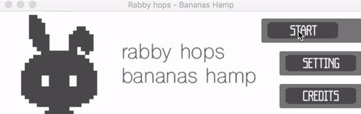
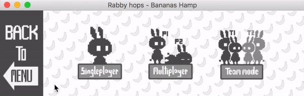
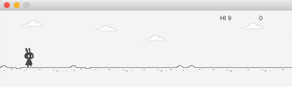
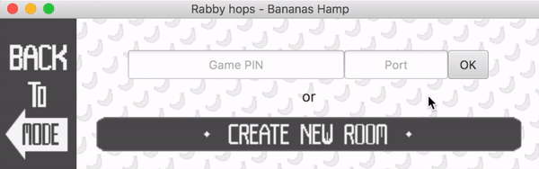
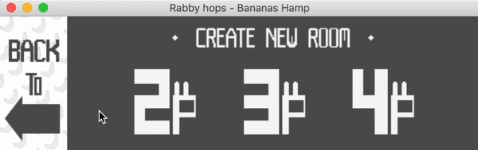
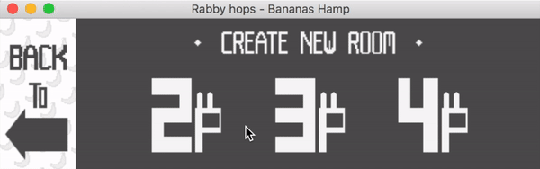
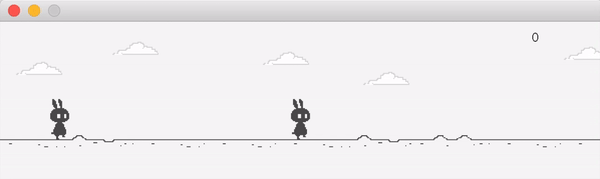
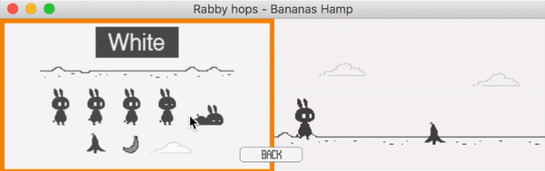

# RabbyHopBanaHamp
by Gunthee Tawewatmongkol ID 6010546915

**Contents**
- [About the program](#about-the-program)
- [Installation](#installation)
- [Demo User](#demo-user)
- [What we use in this program](#what-we-use-in-this-program)

# About the program
### Description
   An arcade game that players have to jump and dash across a banana peel-flying banana as far as 
possible without dying.(This project has a similarly idea with “T-rex chrome offline game”.)

### Details
   There are 3 modes in this game, single player mode, multiplayer mode, and team mode. The player 
plays as a rabbit and must press up to jump once, press down to dash. The game consists of an endless 
series of obstacles in a set path(banana peels and flying banana).The player must time movements 
correctly in order to pass these obstacles without dying. Every millisecond will earn 1 point.
Before playing, the player can choose theme of the game which are white and black theme(the picture 
in example) and can set the buttons in the setting menu.
	For single player mode, the player just breaks the previous high score.
	For multiplayer mode, the players have to choose number of players(2-4 players). The last player 
survived(get the highest score)is the winner. If there are more than one player that reach the highest 
score, all of them will be the winners.
	For team mode, 2 players have to pass the obstacles to get the points.

# Installation
This program runs on Java 8 with Internet Connection(multiplayer mode).
### Required Library
The Object Client-Server Framework (OCSF) -> https://skeoop.github.io/frameworks/ocsf-231.jar
### How to run
You can download the game and run it on your IDE or by open jar file 
1. Download whole folder >> 
   Click [here](https://github.com/KameriiJ/RabbyHopBananasHamp) to get through the git hup repo.
2. Runs RabbyHopsBananasHamp.jar file. >> Click [here](https://drive.google.com/open?id=1dXeLXxuFR0LmIn9afgVDqQBQJIPGPBGj) to get jar file.

# Demo user
### Home page
There are 3 choices.
- Start >> to choose the mode
- Setting >> to set the buttons
- Credits >> to show credits

### Mode selection

### Single mode
After selected the theme, the game will run immediately.

### Mutiplayer mode
In this mode, player has to connect the internet connection. Player will play with others in
the different computer.

- Player can input the game ID and port number, if another player already create and open room.

 
 
- But if player want to play new game, player has to create the new room.

  
  
- After clicked 'create new room' button, player has to choose the number of players that they want to play.

- The next window will show game Id and port number. Press 'open room' button and let another player to join with you.

### Team mode
In this mode, Player can play with another one in the same computer. They have to pass the endless obstacles together.

### Theme slection
Player has to choose theme before play every game.

# What we use in this program

