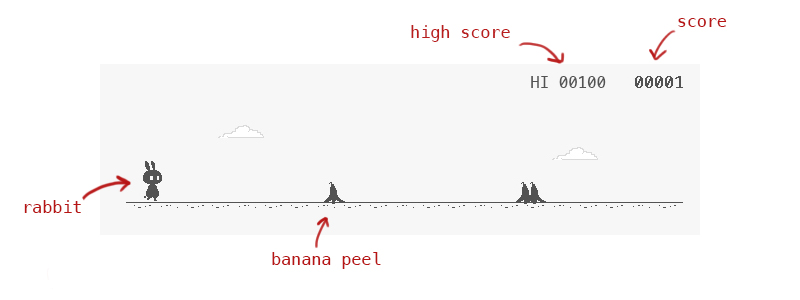

# RabbyHopBanaHamp
by Gunthee Tawewatmongkol ID 6010546915

**Contents**
- [About the program](#about-the-program)
- [Installation](#installation)
- [What we use in this program](#what-we-use-in-this-program)

# About the program
### Description
		An arcade game that players have to jump and dash across a banana peel-flying banana as far as possible without dying.
	(This project has a similarly idea with “T-rex chrome offline game”.)

### Details
		There are 3 modes in this game, single player mode, multiplayer mode, and team mode. The player plays as a rabbit and must press up 
	to jump once, press down to dash. The game consists of an endless series of obstacles in a set path(banana peels and flying banana).
	The player must time movements correctly in order to pass these obstacles without dying. Every millisecond will earn 1 point.
	Before playing, the player can choose theme of the game which are white and black theme(the picture in example) and can set the
	buttons in the setting menu.
		For single player mode, the player just breaks the previous high score.
		For multiplayer mode, the players have to choose number of players(2-4 players). The last player survived(get the highest score) 
	is the winner. If there are more than one player that reach the highest score, all of them will be the winners.
		For team mode, 2 players have to pass the obstacles to get the points.

# Installation
This program runs on Java 8 with Internet Connection(multiplayer mode).
### Required Library
The Object Client-Server Framework (OCSF) -> https://skeoop.github.io/frameworks/ocsf-231.jar
### How to run
You can download the game and run it on your IDE or by open jar file 
1. Download whole folder >> 
   Click [here](https://github.com/KameriiJ/RabbyHopBananasHamp) to get through the git hup repo.
2. Runs RabbyHopsBananasHamp.jar file. >> Click [here](https://drive.google.com/open?id=1YqH_iy2O3x5nyYIO6k0v3K-QUsrONSLS) to get jar file.
    
# What we use in this program
(not finish)

